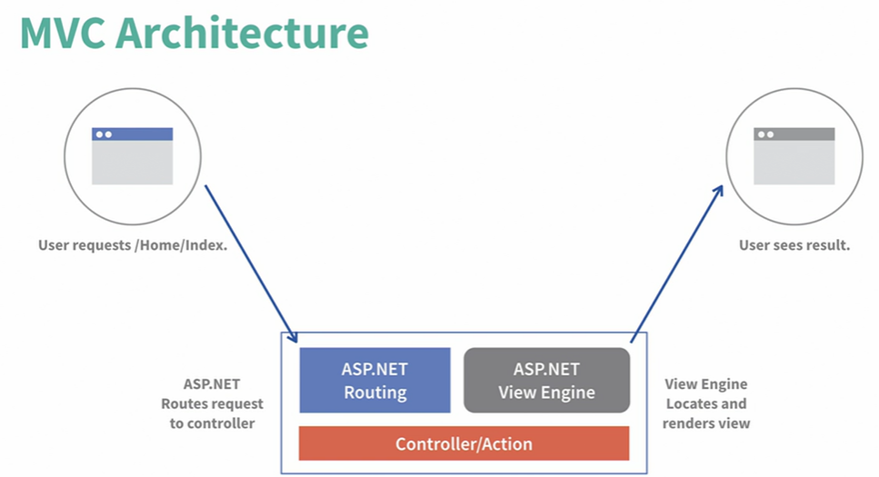
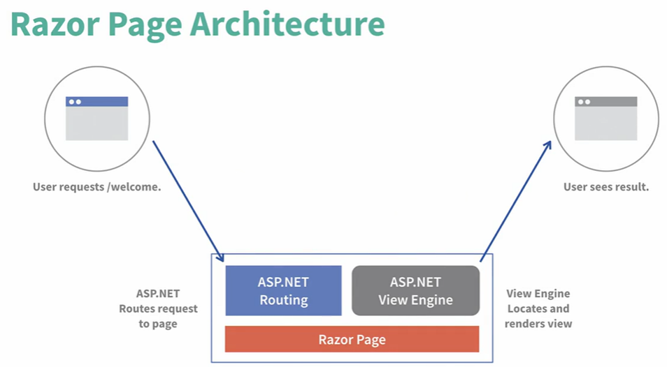

ASP.NET Razor Pages is a server-side, page-focused framework that enables building dynamic, data-driven websites with clean separation of concerns.

## Benefits
- Lightweight
- Flexible
- Full control over HTML, server side HTML generation
- Cross-platform


## Razor Pages vs ASP.NET MVC





## Key concepts
- Razor files(or content pages) - intended to be browsable and contain a mixture of client side(HTML) and server-side code(C#)
    - @page - directive specifies it's a Razor Page
    - @model - directive specifies the model
    - @{...} - Razor code block

- Model binding - used to pass data
    - one way: loading data in grid
    
    - two way: form validation
    ```
    <a asp-page-handler="MyOnClick"> Click me </a>
    ```
    
    - event binding: user click 
    ````
    @*<a asp-page-handler="MyOnClick"> Click me </a>*@
    ```

- Model validation
```
    <span asp-validation-for="@Model.Rate" class="text-danger"></span>


    if (!ModelState.IsValid)
    {
        return Page();
    }
```


## Entity Framework
Tools > NuGet Package Manager > 

Install
    - Microsoft.EntityFrameworkCore
    - Microsoft.EntityFrameworkCore.SqlServer
    - Microsoft.EntityFrameworkCore.Tools

1. Create DB
Create DB in the Server Explorer in VS

2. Get connection str
```
appsettings.json

  "ConnectionStrings": {
    "DefaultConnection": "Data Source=BENTKPAD\\SQLEXPRESS;Initial Catalog=MoviesApp-Db;Integrated Security=True;Pooling=False"
  }
```
3. Config Entity Framework Core
Create ApplicationDbContext

```
// program.cs
builder.Services.AddScoped<IMoviesService, MoviesService>();

builder.Services.AddDbContext<ApplicationDbContext>(options =>
options.UseSqlServer(builder.Configuration.GetConnectionString("DefaultConnection")));
```


4. Init
Tools > NuGet Package Manager > Package Manager Console
```
    PM> Add-Migration Initial

    PM> Update-Database
```


## Service
Inject service

```
    // Program.cs
    
    builder.Services.AddScoped<IMoviesService, MoviesService>();
```