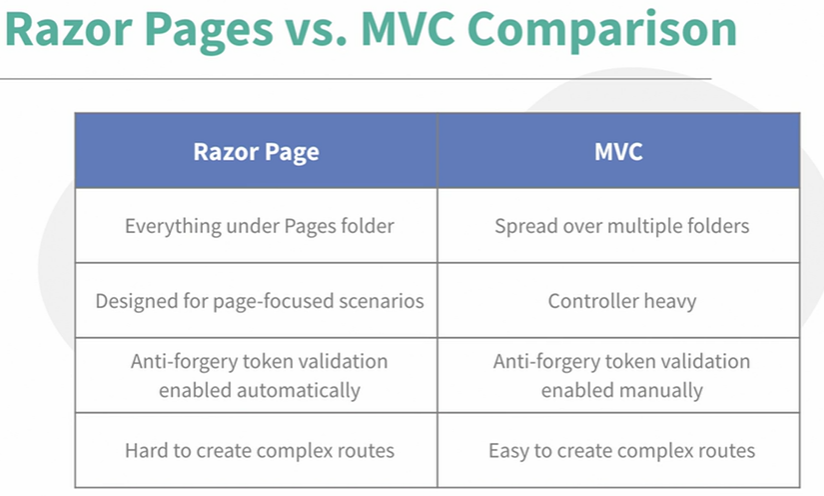

ASP.NET Razor Pages is a server-side, page-focused framework that enables building dynamic, data-driven websites with clean separation of concerns.

## Benefits
- Lightweight
- Flexible
- Full control over HTML, server side HTML generation
- Cross-platform

## Razor Pages vs ASP.NET MVC

## Key concepts
- Razor files(or content pages) - intended to be browsable and contain a mixture of client side(HTML) and server-side code(C#)
    - @page - directive specifies it's a Razor Page
    - @model - directive specifies the model
    - @{...} - Razor code block

- Model binding - used to pass data
    - one way: loading data in grid
    - two way: form validation
    - event binding: user click 

- Model validation

